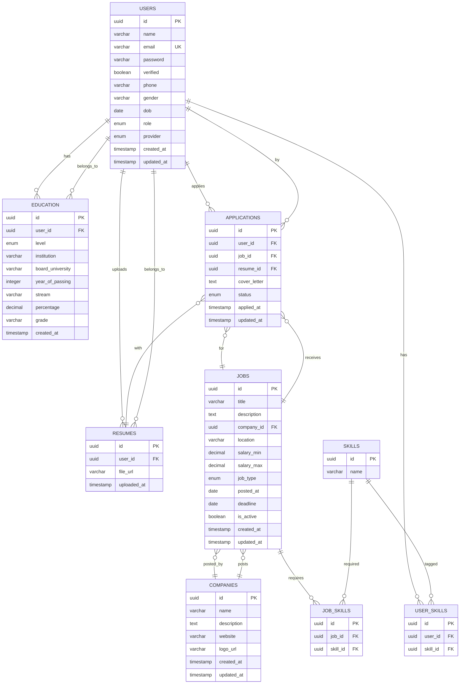

# Job Portal Database Schema

## Current Database Schema

### Users Table (Implemented)

```sql
CREATE TABLE users (
    id UUID NOT NULL PRIMARY KEY DEFAULT (uuid_generate_v4()),
    name VARCHAR(100) NOT NULL,
    email VARCHAR(255) NOT NULL UNIQUE,
    password VARCHAR(100) NOT NULL,
    verified BOOLEAN NOT NULL DEFAULT FALSE,
    phone VARCHAR(20),
    gender VARCHAR(10),
    dob DATE,
    role user_role NOT NULL DEFAULT 'User',
    provider auth_provider NOT NULL DEFAULT 'Local',
    created_at TIMESTAMP WITH TIME ZONE DEFAULT NOW(),
    updated_at TIMESTAMP WITH TIME ZONE DEFAULT NOW()
);
```

## Entity Relationship Diagram (ERD)

This diagram shows how all user-related data is linked. Fetching a user allows you to join and retrieve all their education, resumes, jobs applied for, and skills.



## Table Relationships Explained

- **USERS**: Central entity. All other user-related data links to this table via `user_id`.
- **EDUCATION**: Each user can have multiple education records (10th, 12th, BTech, etc.).
- **RESUMES**: Each user can upload multiple resumes (file URLs).
- **APPLICATIONS**: Each application links a user to a job and the resume used for that application.
- **USER_SKILLS**: Many-to-many relationship between users and skills.
- **JOBS**: Job postings, linked to companies. Each job can require multiple skills (JOB_SKILLS).
- **COMPANIES**: Companies post jobs.
- **SKILLS**: Skills can be tagged to both users and jobs for matching.

## Fetching a User's Full Profile (Example SQL)

To fetch a user's full profile, including all education, resumes, jobs applied for, and skills:

```sql
SELECT
    u.id AS user_id,
    u.name,
    u.email,
    u.phone,
    u.gender,
    u.dob,
    u.role,
    u.provider,
    u.created_at,e
    u.updated_at,
    -- Education (array of JSON objects)
    (
        SELECT json_agg(e.*)
        FROM education e
        WHERE e.user_id = u.id
    ) AS education,
    -- Resumes (array of JSON objects)
    (
        SELECT json_agg(r.*)
        FROM resumes r
        WHERE r.user_id = u.id
    ) AS resumes,
    -- Skills (array of skill names)
    (
        SELECT array_agg(s.name)
        FROM user_skills us
        JOIN skills s ON us.skill_id = s.id
        WHERE us.user_id = u.id
    ) AS skills,
    -- Applications (array of JSON objects, each with job info)
    (
        SELECT json_agg(json_build_object(
            'application', a.*,
            'job', (
                SELECT row_to_json(j)
                FROM jobs j
                WHERE j.id = a.job_id
            ),
            'resume', (
                SELECT row_to_json(r2)
                FROM resumes r2
                WHERE r2.id = a.resume_id
            )
        ))
        FROM applications a
        WHERE a.user_id = u.id
    ) AS applications
FROM users u
WHERE u.id = $1;
```

- This query returns a single user row with nested arrays/objects for education, resumes, skills, and applications (each application includes job and resume info).
- You can adapt this for your ORM or API as needed.

## Complete SQL Schema

### Enums

```sql
-- User roles
CREATE TYPE user_role AS ENUM ('Admin', 'User', 'Guest');

-- Authentication providers
CREATE TYPE auth_provider AS ENUM ('Local', 'Google', 'Github');

-- Education level
CREATE TYPE education_level AS ENUM ('Tenth', 'Twelfth', 'Diploma', 'BTech', 'MTech', 'PhD', 'Other');

-- Job type
CREATE TYPE job_type AS ENUM ('FullTime', 'PartTime', 'Internship', 'Contract', 'Remote', 'Temporary');

-- Application status
CREATE TYPE application_status AS ENUM ('Applied', 'Reviewed', 'Shortlisted', 'Interview', 'Offered', 'Rejected', 'Withdrawn');
```

### Tables

#### 1. Users (Current)

```sql
CREATE TABLE users (
    id UUID NOT NULL PRIMARY KEY DEFAULT (uuid_generate_v4()),
    name VARCHAR(100) NOT NULL,
    email VARCHAR(255) NOT NULL UNIQUE,
    password VARCHAR(100) NOT NULL,
    verified BOOLEAN NOT NULL DEFAULT FALSE,
    phone VARCHAR(20),
    gender VARCHAR(10),
    dob DATE,
    role user_role NOT NULL DEFAULT 'User',
    provider auth_provider NOT NULL DEFAULT 'Local',
    created_at TIMESTAMP WITH TIME ZONE DEFAULT NOW(),
    updated_at TIMESTAMP WITH TIME ZONE DEFAULT NOW()
);

CREATE INDEX users_email_idx ON users (email);
CREATE INDEX users_role_idx ON users (role);
```

#### 2. Education

```sql
CREATE TABLE education (
    id UUID NOT NULL PRIMARY KEY DEFAULT (uuid_generate_v4()),
    user_id UUID NOT NULL REFERENCES users(id) ON DELETE CASCADE,
    level education_level NOT NULL,
    institution VARCHAR(255) NOT NULL,
    board_university VARCHAR(255),
    year_of_passing INTEGER,
    stream VARCHAR(100),
    percentage DECIMAL(5,2),
    grade VARCHAR(10),
    created_at TIMESTAMP WITH TIME ZONE DEFAULT NOW()
);

CREATE INDEX education_user_id_idx ON education (user_id);
CREATE INDEX education_level_idx ON education (level);
```

#### 3. Resumes

```sql
CREATE TABLE resumes (
    id UUID NOT NULL PRIMARY KEY DEFAULT (uuid_generate_v4()),
    user_id UUID NOT NULL REFERENCES users(id) ON DELETE CASCADE,
    file_url VARCHAR(500) NOT NULL,
    uploaded_at TIMESTAMP WITH TIME ZONE DEFAULT NOW()
);

CREATE INDEX resumes_user_id_idx ON resumes (user_id);
```

#### 4. Companies

```sql
CREATE TABLE companies (
    id UUID NOT NULL PRIMARY KEY DEFAULT (uuid_generate_v4()),
    name VARCHAR(255) NOT NULL,
    description TEXT,
    website VARCHAR(255),
    logo_url VARCHAR(500),
    created_at TIMESTAMP WITH TIME ZONE DEFAULT NOW(),
    updated_at TIMESTAMP WITH TIME ZONE DEFAULT NOW()
);

CREATE INDEX companies_name_idx ON companies (name);
```

#### 5. Jobs

```sql
CREATE TABLE jobs (
    id UUID NOT NULL PRIMARY KEY DEFAULT (uuid_generate_v4()),
    title VARCHAR(255) NOT NULL,
    description TEXT NOT NULL,
    company_id UUID REFERENCES companies(id) ON DELETE SET NULL,
    location VARCHAR(255),
    salary_min DECIMAL(10,2),
    salary_max DECIMAL(10,2),
    job_type job_type NOT NULL,
    posted_at DATE DEFAULT CURRENT_DATE,
    deadline DATE,
    is_active BOOLEAN NOT NULL DEFAULT TRUE,
    created_at TIMESTAMP WITH TIME ZONE DEFAULT NOW(),
    updated_at TIMESTAMP WITH TIME ZONE DEFAULT NOW()
);

CREATE INDEX jobs_company_id_idx ON jobs (company_id);
CREATE INDEX jobs_job_type_idx ON jobs (job_type);
CREATE INDEX jobs_is_active_idx ON jobs (is_active);
```

#### 6. Applications

```sql
CREATE TABLE applications (
    id UUID NOT NULL PRIMARY KEY DEFAULT (uuid_generate_v4()),
    user_id UUID NOT NULL REFERENCES users(id) ON DELETE CASCADE,
    job_id UUID NOT NULL REFERENCES jobs(id) ON DELETE CASCADE,
    resume_id UUID REFERENCES resumes(id) ON DELETE SET NULL,
    cover_letter TEXT,
    status application_status NOT NULL DEFAULT 'Applied',
    applied_at TIMESTAMP WITH TIME ZONE DEFAULT NOW(),
    updated_at TIMESTAMP WITH TIME ZONE DEFAULT NOW()
);

CREATE INDEX applications_user_id_idx ON applications (user_id);
CREATE INDEX applications_job_id_idx ON applications (job_id);
CREATE INDEX applications_status_idx ON applications (status);
```

#### 7. Skills

```sql
CREATE TABLE skills (
    id UUID NOT NULL PRIMARY KEY DEFAULT (uuid_generate_v4()),
    name VARCHAR(100) NOT NULL UNIQUE
);

CREATE INDEX skills_name_idx ON skills (name);
```

#### 8. User Skills

```sql
CREATE TABLE user_skills (
    id UUID NOT NULL PRIMARY KEY DEFAULT (uuid_generate_v4()),
    user_id UUID NOT NULL REFERENCES users(id) ON DELETE CASCADE,
    skill_id UUID NOT NULL REFERENCES skills(id) ON DELETE CASCADE
);

CREATE UNIQUE INDEX user_skills_user_skill_idx ON user_skills (user_id, skill_id);
```

#### 9. Job Skills

```sql
CREATE TABLE job_skills (
    id UUID NOT NULL PRIMARY KEY DEFAULT (uuid_generate_v4()),
    job_id UUID NOT NULL REFERENCES jobs(id) ON DELETE CASCADE,
    skill_id UUID NOT NULL REFERENCES skills(id) ON DELETE CASCADE
);

CREATE UNIQUE INDEX job_skills_job_skill_idx ON job_skills (job_id, skill_id);
```

## Implementation Priority

### Phase 1: Core Job Portal (High Priority)

1. **User/Education/Resume** - User registration, education, resume upload
2. **Jobs/Companies** - Job posting, company profiles
3. **Applications** - Users apply to jobs

### Phase 2: Enhanced Features (Medium Priority)

1. **Skills** - User/job skill tagging and matching
2. **Application status tracking**
3. **Job search and filtering**

### Phase 3: Advanced Features (Low Priority)

1. **Interview scheduling**
2. **Notifications**
3. **Analytics and reporting**
